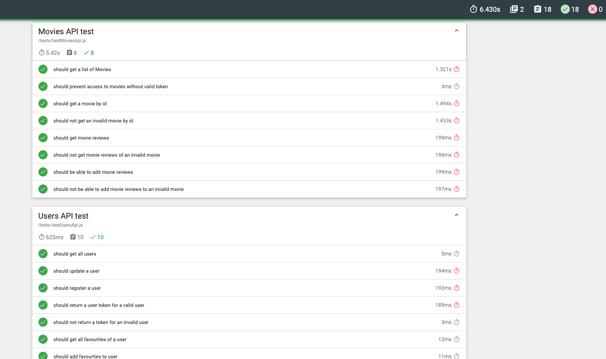

# Assignment 2 - Web API.

Name: Oleksandr Kononov

## Overview

This web api functionality provides api for the Movie App frontend, allowing fetching of movies, movie reviews, movie genres, users and actors. It also provides athentication via tokens to allow access to protected api's. The api allows users to register, athenticate, update the favourite movies/password, save favourite movies, remove favourite movies and get their favourite movies. The movie api allows an authenticated user to view all the available movies, specific movies, movie reviews, movie actors and also post their own reviews. Finally the user also has access to view speicific actors and the movies they starred in.

## Installation Requirements

Describe what needs to be on the machine to run the API (Node v?, NPM, MongoDB instance, any other 3rd party software not in the package.json). 
- NodeJS (10.16.3+)
- NPM (6.9.0+)
- MongoDB
- (Optional) Docker for running a local instance of MongoDB
- (Optional) Git for cloning this repo (can be downloaded as zip from GitHub)
- Terminal

### To Install The Software:
- Download NodeJS [here](https://nodejs.org/en/download/) (comes with NPM)
- Download Docker [here](https://www.docker.com/get-started)
- Download Git [here](https://git-scm.com/downloads)
- To install MongoDB using docker run `docker run -d -p 27017-27019:27017-27019 --name mongodb mongo:4.2.1`
- (Optional) To clone this repo run `git clone *this url*`


## API Configuration
Create a *.env* file in the root of the repo for this project and add config variables:
- *NODE_ENV* specifies the environment to run in, options are "development" and "test"
- *PORT* specifies the port to run api on
- *HOST* specifies the host to run the api on
- *TMDB_KEY* specifies key to access TMDB api (required)
- *mondoDB* specifies the url to access mongoDB
- *seedDb* boolean whether to seed the DB for testing purposes
- *secret* specifies secret key to use for JWT tokens

### Example .env configuration
```bat
NODE_ENV=development
PORT=8080
HOST=localhost
TMDB_KEY=123456789012345678901234567890
mongoDB=mongodb://localhost:27017/movies_db
seedDb=true
secret=YourJWTSecret
```

## Startup
### Running the API
In your terminal window, navigate to the root of this repo and run
`npm install && npm start`

To stop running the API hit *Ctrl+C*

### Running the unit tests
In your terminal window, navigate to the root of this repo and run
`npm install && npm run unit-test`

### Running the API tests
In your terminal window, navigate to the root of this repo and run
`npm install && npm run test`

## API Design
Give an overview of your web API design. If you don't have a Swagger description, you could describe similar to the following: 

|  |  GET | POST | PUT | DELETE
| -- | -- | -- | -- | -- 
| /api/movies |Gets a list of movies | N/A | N/A | N/A
| /api/movies/{movieid} | Get a Movie | N/A | N/A | N/A
| /api/movies/{movieid}/reviews | Get all reviews for movie | Create a new review for Movie | N/A | N/A  
| /api/movies/{movieid}/credits | Get all credits for movie | N/A | N/A | N/A  
| /api/users/ | Get all users | Register/login in a user | N/A | N/A 
| /api/users/{userName} | N/A | N/A | Update a user (favourites list and/or password only) | N/A 
| /api/users/{userName}/favourites | Get all favourite movies of a user | Add a movies to users favourites | N/A | N/A 
| /api/users/{userName}/favourites/{movieId} | N/A | N/A | N/A | Remove a movie from users favourites
| /api/genres | Get a list of movie genres | N/A | N/A | N/A
| /api/actor/{id} | Get an actor | N/A | N/A | N/A
| /api/actor/{id}/movies | Get a list of movies the actor starred in | N/A | N/A | N/A

[SwaggerHub Doc](https://app.swaggerhub.com/apis/ASimpleMeow/Movie/initial)


## Security and Authentication
In order to access an movie route (routes starting with `/api/movies`) the user must authenticate, authentication process uses *passport* library and *JWT*. To authenticate the user must login with their *username* and *password* using `/api/users/` POST api, which will return the token to use for authentication for future requests.

## Testing
### Unit Tests
The unit tests will test the DB schemas of *Movie* and *User* and can be found in `/api/movies/tests/testMovieSchema` and `/api/users/tests/testUserSchema` directories respectively.
#### Movies Schema
- Should validate a movie id
- Should require a movie id
- Should store movie reviews
- Should get movies by id
- Should get reviews of movies

#### User Schema
- Should require a username and password
- Should validate a user with a username and password
- Should search using username
- Should detect matching passwords
- Should be able to store favourite movies list

### Integration Tests/API Tests
These test combine the usage of schemas and test the API and what is expected to be returned/not returned these tests can be found in `/tests/` directory. *MoviesAPI* and *UsersAPI* are tested here, genres and actors don't have a schema and are pull directly from TMDB api as such are not tested here.

#### Movies API
- Should get a list of movies
- Should prevent access to movies without valid token
- Should get a movie by id
- Should not get an invalid movie by id
- Should get movie reviews
- Should not get movie reviews of an invalid movie
- Should be able to add movie reviews
- Should not be able to add movie reviews to an invalid movie

#### Users API
- Should get all users
- Should update a user
- Should register a user
- Should return a user token for a valid user
- Should not return a token for an invalid user
- Should get all favourites of a user
- Should add favourties to user
- Should not add invalid favourites to user
- Should not add nonexistent favourites to user
- Should be able to delete favourites



## Integrating with React App

This API repo is integrated with the Movies App project [here](https://github.com/ASimplemeow/MovieApp) 

~~~Javascript
export const getMovies = () => {
  return fetch(
     '/api/movies',{headers: {
       'Authorization': window.localStorage.getItem('token')
    }
  }
  )
    .then(res => res.json())
    .then(json => {return json.results;});
};

~~~

## Extra features

## Independent learning.
